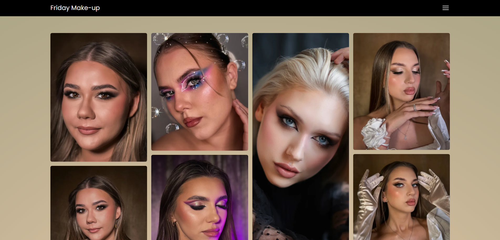
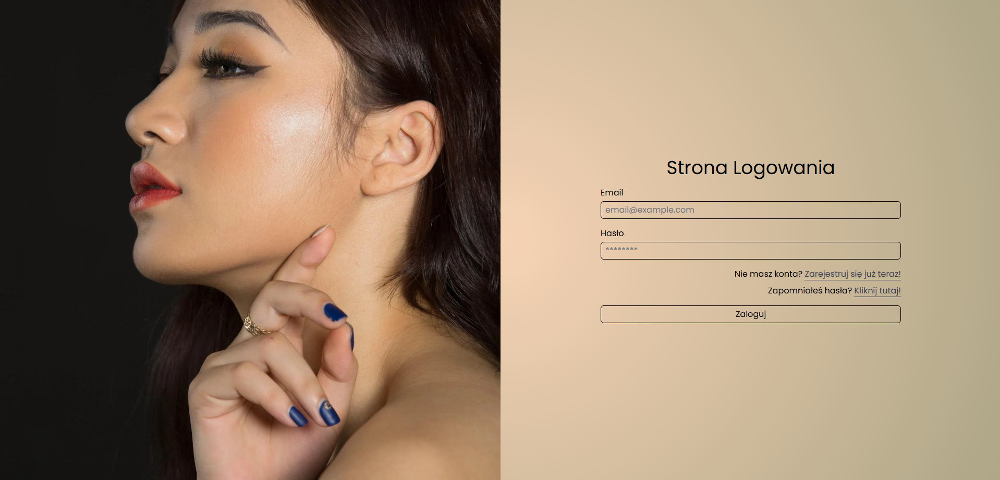

# 💻 Fridaymake-up

A web application that allows make-up clients to sign up for a contact list.

## 🛠️ Technologies

- Angular 19
- NestJS 11
- TypeScript
- TailwindCSS
- Firebase
- Karma
- Jest
- Docker
- Render.com (hosting)

## 🎯 Features

- ✅ Home page with description
- ✅ Advanced Authorization & Authentication (JWT with Refresh Token passed by cookies)
- ✅ Gallery of portfolio and certificates images
- ✅ Possibility to reset password (Mailing System)
- ✅ Responsive design
- ✅ API Secure
- ✅ Use store tools on frontend (NgRX)
- ✅ Docker
- ✅ Cloudinary
- ✅ Advanced architecture of appliaction (Frontend and Backend)

## 🌐 Demo
- 🔗 [https://fridaymake-up.onrender.com/](https://fridaymake-up.onrender.com/)

## 🧠 Author
- Daniel Miliczek
- GitHub: @ShadowBlack77

## 📸 Screenshots

